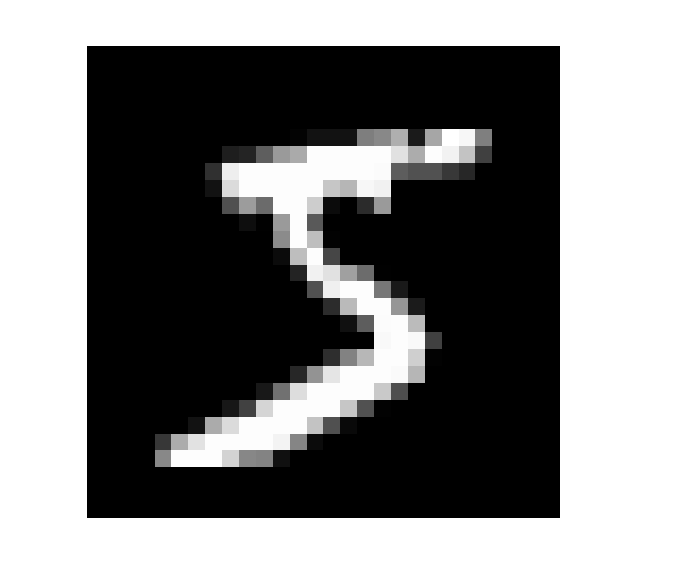
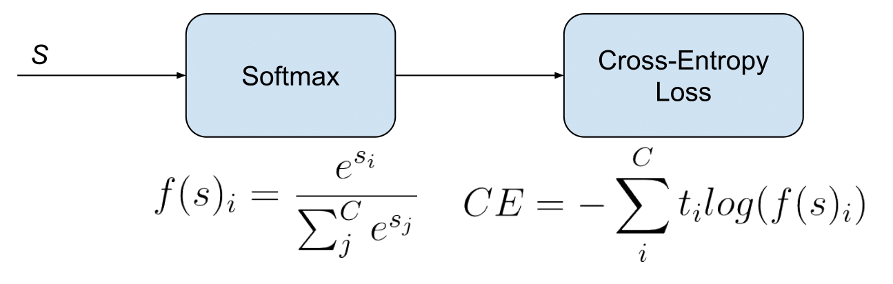
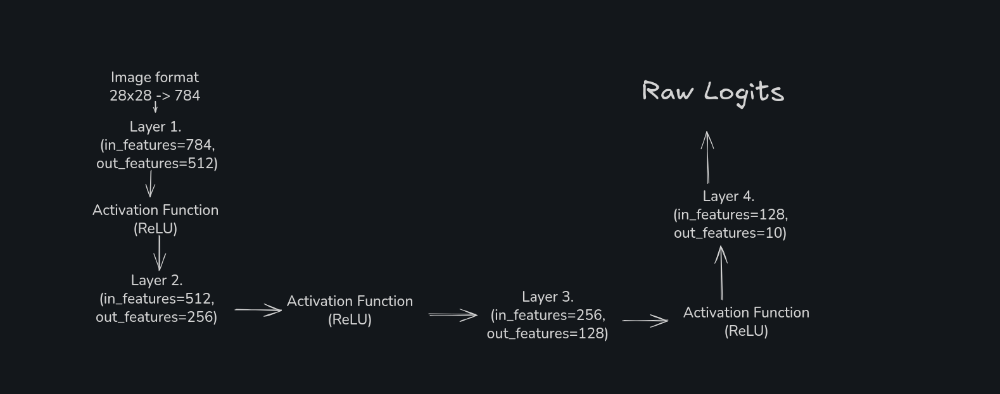
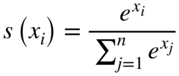
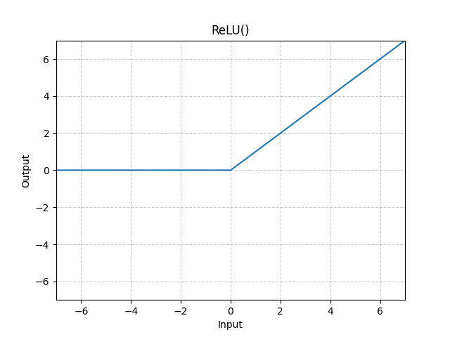
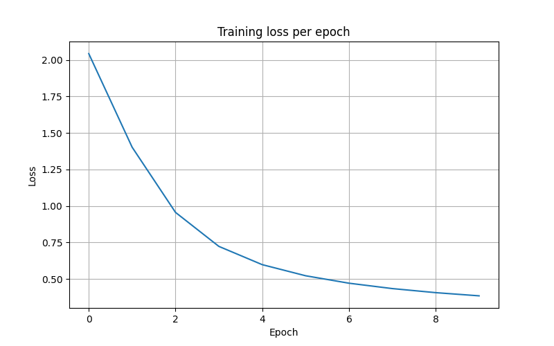

# MNIST from scratch (NumPy)

## Description
The goal of this project is to understand how PyTorch-like code works under the hood and basic mathematical principles commonly used in Neural Networks.

This project includes the following concepts:
* Activation function (ReLU)
* Softmax 
* Optimizer (SGD)
* CrossEntropyLoss
* Weights & bias

As showcase I chose the **MNIST dataset**. It contains 60_000 grayscale images of size **28x28**. There are 10 classes, where each class represents a handwritten digit from 0 to 9. MNIST is considered to be one of the easiest tasks in ML, which makes it a great dataset for experimentation.



## Understanding of Neural Network

Before we start diving in code, we should first understand what a neural network actually does with our data.

Let's start with formula

```
f(x) = x * W + b
```
where:

    x = input data

    W = weights

    b = bias


### **Input data (x)**

In the case of MNIST, the input data is a **28x28** grayscale image, which can be represented as a 28x28 matrix. Each element is a value in the range **0-1**, representing the brightness of a pixel (for example, *1 means the pixel is fully bright, while 0.5 means the pixel is darker*)

However, our model expects a vector, not a 2D matrix. Therefore, we must transform the **28x28** matrix into a vector of size 784. This process is called **flattening**. 

Although we work with vectors, the model still expects a matrix as an input. Why? Because the first dimensions is always represents the batch_size.

    For example, if the batch size is 32, the input will have the shape:
    ```
    [32, 784]
    ```

So we still have a matrix, not a tensor.

Batch size helps reduce computational cost and memory usage. As mentioned earlier, the dataset contains 60_000 images. If we attempt to train all of them at once, it would require a large amount of RAM. Instead, we split the dataset into smaller batches. Training 32 images at a time is significantly more efficient than processing all 60_000 images simultaneously.

To summarize, the input image is transformed from:
    ```
    28x28 matrix -> vector of size 784
    ```

### **Weights**

Weights allow the model to learn patterns and recognize them.

As we already know, the input has a shape of `[batch_size, 784]`. The value of **out_features** can be anything we choose. For example, if out_features = 128, the transformation will map:
    ```
    784 -> 128
    ```
while keeping the **batch size** untouched.

We will discuss the purpose of this transformation later. For now, the key idea is that weights are a matrix that maps **input features to output features**

#### How weights are initialized?

Weights are initialized randomly. We do not choose specific values manually - they are generated using random initialization.

Later, during the training, the model evaluates how well its predictions match the expected outputs. Based on this difference, the weights are **adjusted gradually** to improve model's predictions.

We will discuss this training model process in more detail later

### **bias**

Bias is also a matrix with shape:
```
[1, out_features]
```

Like weights, it is initialized randomly and updated during the training.

Bias allows model to *shift the output* of the linear transformation. Without bias, the transformation `X @ W` would always pass through the origin (0, 0)

Bias introduces a small *offset*, allowing model to move the decision boundary and represent more flexible relationships in data.


#### Now when we understand main concepts we can move forward.

## How does our model learn?

As mentioned earlier, our model starts with **random weights**. Over time, it will see that these initial weights are far from optimal. The model must **adjust** these values so that the next iteration it can recognize patterns more accurately. How do we do this?

### 1. Loss

Simply put, loss is the difference between expecting output and the model's prediction. Sometimes it is called 'criterion', but here we will keep things simple and easy to understand.

The MNIST dataset has 60_000 images of handwritten digits, each with a corresponding **true label**. After the model makes a prediction using the random weights and bias, we can calculate the **loss**. There are different ways to calculate the loss, but for **multiclass classification**, the standard choice is:
**CrossEntropyLoss**. 

Formula:



It may look intimidating at first, but it is simpler than it seems. We will discuss what it does in detail, when we look at the code.


### 2. Gradients
Once we have computed the loss, we need to determine in which **direction** the loss increases. To do this, we calculate the derivative with respect to each value in the matrices.

For example, consider a 2x2 weights matrix:
```
W = [[a11, a12],
     [a21, a22]]
```
After computing the loss, we calculate the derivative for each element `aij`. The collection of these derivatives is called the **gradient**

Since a model usually has multiple layers (`f(x) = X @ W + b` repeated), we compute gradients **starting from the last layer and moving backward**. This process is called backpropagation. Updating the weights and biases using these gradients is called **gradient descent**.

Remember: the gradient shows the direction in which the loss **increases**, so to minimize the loss, we move in the *opposite direction*.

#### How do we calculate gradients?

For each layer:
* `dW = X.T @ dZ` -> gradient of loss with respect to weights
* `db = sum(dZ, axis=1, keepdims=True)` -> gradient of loss with respect to bias
* `dX = dZ @ W.T` -> gradient with respect to input (used for the previous layer)

Where:
* `X` is the input to the layer
* `W` is the weight matrix
* `dZ` is derivative of the loss with respect to the layer output

**Note**: `X.T` or `W.T` denotes matrix transpose.

**Summary**: Each gradient tells us how much a smaller change in a parameter affects the loss.

### 3. Gradient Descent

**Gradient descent** is used to update the parameters.

The basic update rule is:
```
W = W - lr * gradient
```

Where:
* `lr` - learning rate (a hyperparameter, often 0.01)
* `W` - model parameters (weights)
* `gradient` - derivative of the loss with respect to the parameters

In this project, we use more advanced approach called **Stochastic Gradient Descent (SGD)**. We will discuss its details when we examine the code.

## Architecture

Let's take a look at the **architecture of the model**. We already know how the model learns and what its parameters are. Defining the architecture means combining *different layers* in a specific order.



We will discuss **activation function** later. For now, we can see that model has 4 layers. Pay attention to how they are connected: **each layer's output shape matches the input shape of the next layer**. Essentially, the model "compresses" the image at each layer, learning increasingly **generalized patterns** at it progress.

Why does the last layer have `out_features=10`, and what are logits?

Since MNIST is a classification problem with 10 classes (digits 0-9), the model's raw output are called logits. These numbers may seem almost random at first. For example:

```
logits = [2.1, -1.3, 0.4, -0.7, 0.2, -1.8, -0.5, 3.6, 0.1, -0.9]
```
Each index corresponds to a specific digit. For instance, **index 2 has value 0.4**, which means the model estimates the probability of the input digit `2` is 0.4. Logits can even be negative, so it's hard for humans to interpret them directly.

To convert these raw outputs into **prediction probabilities**, we use softmax function:



After applying softmax, we get:
```
probabilities = [0.09, 0.01, 0.04, 0.02, 0.03, 0.01, 0.02, 0.73, 0.04, 0.01]
```

These probabilities are *normalized* percentages that sum to 1 (`sum(probabilities) = 1`). The highest probability represents the model's prediction. In this example, the highest probability is `0.73` at index 7, so the model predicts the image as digit `7`.

## Theory Conclusion

I hope you found my explanation useful. Before we move into **code section**, here are some useful resources I used to learn the basic concepts of neural networks:

* [CS50's Introduction to AI](https://www.youtube.com/watch?v=5NgNicANyqM&t=2s)
* [Mathematics for Machine Learning](https://mml-book.github.io/book/mml-book.pdf)
* [PyTorch Course for beginners](https://www.youtube.com/watch?v=V_xro1bcAuA&t=74897s)


## Project structure

This project is organized into several modules, each responsible for a specific part of the neural network implementation:

* `layers.py` - Implementation of neural network layers (Dense Layer)
* `loss.py` - Implementation of **CrossEntropyLoss**
* `activations.py` - Activation functions (ReLU and Softmax)
* `optimization.py` - Implementation of the **SGD** optimizer.
* `data.py` - utility for loading the MNIST dataset into NumPy arrays
* `main.py` - Entry point of the project, where the model is built and training is executed

## Dense Layer (layers.py)

The **Dense Layer** (also called as Fully Connected Layer) performs a linear transformation of the input data.

### Implementation

```python
import numpy as np

class Dense:
    def __init__(self, in_features, out_features):

        # Initialize random weights
        self.W = np.random.randn(in_features, out_features) * np.sqrt(2 / in_features)

        # Initialize bias
        self.b = np.zeros((1, out_features))

    def forward(self, X):
        self.X = X
        return X @ self.W + self.b

    def backward(self, dZ):
        self.dW = self.X.T @ dZ / self.X.shape[0]
        self.db = np.sum(dZ, axis=0, keepdims=True) / self.X.shape[0]
        return dZ @ self.W.T
```

### Weight Initialization
Weights are initialized randomly, but not completely arbitrarily.

If weights are too large or too small, gradients may:

* **explode** (become extremely large) or
* **vanish** (become extremely small)

Both situations making training unstable or prevent model from learning. 

To address this, we use **He Initialization** (**Kaiming Initialization**):

```python
self.W = np.random.randn(in_features, out_features) * np.sqrt(2 / in_features)
```

This initialization method is particularly well suited for networks, that use **ReLU activation function**

More about exploding and vanishing gradients can be found [here](https://www.geeksforgeeks.org/deep-learning/vanishing-and-exploding-gradients-problems-in-deep-learning/)

### Forward Pass
```python
def forward(self, X):
    self.X = X
    return X @ self.W + self.b
```

The forward pass performs the linear transformation:
```
Z = WX + b
```

Where:
* `X` - input data
* `W` - weights
* `b` - bias

The input `X` is stored so it can be reused later during **backpropagation**

### Backward Pass
```python
def backward(self, dZ):
```

During the backward pass we compute gradients of the loss with respect to:
* weights (`dW`)
* bias (`db`)
* input (`dX`)

These gradients are used to update **the model parameters** and **propagate gradients** to previous layers.

The **parameter** `dZ` is the gradient of the loss with respect to the output of the current layer.

Shape:
```
[batch_size, out_features]
```
This gradient is received from the next layer during backpropagation

### Computed Gradients
#### Weight gradient (`self.dW`)
```
dW = X.T @ dZ / batch_size
```
Shape:
```
[in_features, out_features]
```

Explanation:
* `X.T` converts `[batch_size, in_features] -> [in_features, batch_size]`
* Matrix multiplication with `dZ` produces gradients for every weight
* Division by `batch_size` averages gradients across the mini-batch

#### Bias Gradient (`self.db`)
```
db = sum(dZ) / batch_size
```

Shape:
```    
[1, out_features]
```

Explanation:

The same bias is applied to every sample, so we sum up gradients across the batch.

#### Input gradient (`dX`)
```
dX = dZ @ W.T
```


This is the gradient of the loss with respect to the **input of the layer**. It is returned so that the previous layer can continue backpropagation.


## Activations (activations.py)
Activation functions add **non-linearity** to the model. Without them, even a deep network would behaves like a single linear transformation.

```python
import numpy as np

class ReLU:
    
    def forward(self, X):
        self.X = X
        return np.maximum(0, X)
    
    def backward(self, dX):
        dX_out = dX * (self.X > 0)
        return dX_out
```

**Forward pass**: replaces all negative values with zero.
Example:
```python
X = np.array([-3, 2, 0, -1, 4])
ReLU.forward(X)

# Output: [0, 2, 0, 0, 4]
```

* `self.X` - stores input for backward pass
* **Backward pass** - multiplies incoming gradient `dX` by the derivative of ReLU (`1` if X>0 else `0`)
* Shape of output is identical to input




### Softmax
```python
def softmax(logits):
    exps = np.exp(logits - np.max(logits, axis=1, keepdims=True))
    return exps / np.sum(exps, axis=1, keepdims=True)
```

* Converts *raw outputs* (logits) into probabilities for each class
* Each row in `logits` corresponds to a sample in the batch
* Output shape: `[batch_size, num_classes]`
* Ensures that sum of probabilities per sample = 1


## CrossEntropyLoss (loss.py)
This class implements CrossEntropyLoss for multiclass classification, such as MNIST. 

### Implementation

```python
import numpy as np
from activations import softmax

class Loss:
    def forward(self, logits, y_true):

        self.logits = logits
        self.y_true = y_true

        # Softmax
        self.probs = softmax(logits)

        # Calculate the loss
        batch_size = logits.shape[0]
        correct_logprobs = np.log(self.probs[np.arange(batch_size), y_true])
        loss = -np.sum(correct_logprobs) / batch_size
        return loss
    
    def backward(self):
        dZ = self.probs.copy()
        dZ[np.arange(self.logits.shape[0]), self.y_true] -= 1
        dZ /= self.logits.shape[0]
        return dZ
```

### Parameters

#### Forward pass

* `logits` - raw output of the model

    * Shape: `[batch_size, num_classes]`

* `y_true` - ground-truth labels for each sample

    * Shape: `[batch_size]`

#### Logic:
```python
self.logits = logits
self.y_true = y_true
self.probs = softmax(logits)
```

* `self.probs` - stores predicted probabilities for each class
* `correct_logprobs` - selects log-probabilities of the true class
* `loss` - average negative log-likelihood across the batch

#### Backward Pass

* Computes gradient of loss with respect to logits for backpropagation
* Shape of dZ: `[batch_size, num_classes]`

#### Formula:

```python
dZ = self.probs
dZ[range(batch_size), y_true] -= 1
dZ /= batch_size
```

* The gradient is passed to the previous layer during *backpropagation*

## SGD (optimization.py)
Optimizer is responsible for updating the model parameters (**weights** and **biases**) using the gradients computed during backpropagation.

In this project we use Stochastic Gradient Descent (SGD) - one of the simplest and most commonly used optimization algorithms. 

### Why SGD?
SGD updates model parameters using gradients computed on mini-batches instead of the entire dataset. 

Instead of calculating gradients over 60_000 images at once, SGD computes the **average** gradient of a small batch (e.g., 32 samples). This makes training:
* much faster
* less memory intensive
* allows model to update parameters more frequently

### Implementation

```python
class SGD:
    def __init__(self, parameters, lr=0.01):
        self.parameters = parameters
        self.lr = lr

    def zero_grad(self):
        for layer in self.parameters:
            if hasattr(layer, "dW"):
                layer.dW.fill(0)
            if hasattr(layer, "db"):
                layer.db.fill(0)
    
    def step(self):
        for layer in self.parameters:
            if hasattr(layer, "W"):
                layer.W -= self.lr * layer.dW
            if hasattr(layer, "b"):
                layer.b -= self.lr * layer.db
```

### Parameters

1. `parameters` - a list of model layers whose parameters should be updated

Example:
```python
layers = [layer1, layer2, layer3]
optimizer = SGD(parameters=layers, lr=0.01)
```

Each layer may contain:
* `W` - weights
* `b` - bias
* `dW` - gradient of weights
* `db` - gradient of bias

2. `lr` (learning rate) - a hyperparameter, that controls how big the update step will be

Typical values:

    0.1
    0.01
    0.001

If the learning rate is:
* too large -> training may diverge
* too small -> training becomes very slow

#### Parameter update rule

SGD updates parameters using this formula:

    W = W - lr * dW
    b = b - lr * db

### Methods

1. `step()` - updates parameters using gradients.

This step is executed after each mini-batch.

2. `zero_grad()` - Resets gradients to zero, before the next training step 

Gradients accumulate in memory, so if we don't reset them, the next batch will add new gradients on top of the previous ones. 

## Training pipeline (main.py)

This file combines all previously defined components:
* model layers
* activation functions
* loss function
* optimizer
* training loop
* evaluation

It defines the full workflow of training neural network on MNIST.

### Model architecture 

The model is fully connected neural network:

    784 -> ReLU -> 512 -> ReLU -> 256 -> ReLU -> 128 -> ReLU -> 10

* 784 - flattened MNIST image (28x28)
* 512, 256, 128 - hidden units
* 10 - output classes (digits 0-9)

### Implementation:

```python
layer1 = Dense(784, 512)
activation1 = ReLU()

layer2 = Dense(512, 256)
activation2 = ReLU()

layer3 = Dense(256, 128)
activation3 = ReLU()

layer4 = Dense(128, 10)
```

### Training Configuration 
```python
batch_size = 32
EPOCHS = 10
```

* `batch_size` - number of samples processed before updating the model 
* `EPOCHS` - number of full passes through the dataset

Number of full passes through dataset

### Loading dataset 

```python
X_train = load_mnist_images(...)
y_train = load_mnist_labels(...)
```

The dataset is loaded directly from MNIST gzip archive and converted into NumPy arrays

Shapes:

    X_train -> [60_000, 784]
    y_train -> [60_000]

    X_test -> [10_000, 784]
    y_test -> [10_000]

Images are flattened from 28x28 -> 784

### Training loop

The `train_loop()` function implements the complete training process

```python
def train_loop(X_train, y_train, batch_size, epochs):
```

#### Step 1 - shuffle dataset
```python
indices = np.arrange(num_samples)
np.random.shuffle(indices)
```

Shuffling prevents model from learning dataset order patterns

#### Step 2 - create mini-batches

```python
X_batch = X_train[start:end]
y_batch = y_train[start:end]
```

The dataset is split into mini-batches of size 32.

Example:

    [0:32]
    [32:64]
    [64:96]
    ...

#### Forward Pass
The forward pass propagates input data through the network:

    X -> Dense -> ReLU -> Dense -> ReLU -> Dense -> ReLU -> Dense

Implementation:
```python
Z1 = layer1.forward(X_batch)
A1 = activation1.forward(Z1)

Z2 = layer2.forward(A1)
A2 = activation2.forward(Z2)

Z3 = layer3.forward(A2)
A3 = activation3.forward(Z3)

logits = layer4.forward(A3)
```

#### Loss calculation
```python
loss = loss_fn.forward(logits, y_batch)
```

Computes **CrossEntropyLoss**, measuring how far predictions are from true labels

#### Backpropagation
Backpropagation computes gradients for each layer from output -> input 

```python
dZ4 = loss_fn.backward()
dA3 = layer4.backward(dZ4)
dZ3 = activation3.backward(dA3)

dA2 = layer3.backward(dZ3)
dZ2 = activation2.backward(dA2)

dA1 = layer2.backward(dZ2)
dZ1 = activation1.backward(dA1)

layer1.backward(dZ1)
```

Each layer computes gradients:
* `dW` - gradient of weights
* `db` - gradient of bias

#### Parameter update
After gradients are computed, the optimizer updates the parameters:

```python
optimizer.step()
optimizer.zero_grad()
```

This applies the **SGD update rule**:

    W = W - lr * dW
    b = b - lr * db

### Model evaluation

The function `test_evaluation()` evaluates the model on the test dataset

Steps:
1. Forward pass
2. Softmax probabilities
3. Predicted class
4. Accuracy calculation

```python
probs = softmax(logits)
preds = np.argmax(probs, axis=1)
```

Accuracy:
```python
accuracy = correct_predictions / total_samples
```

### Additional functions

1. `predict_single_image()`

This function randomly selects ann image from the test dataset and performs a prediction using the trained model.

Usage:

```python
predict_single_image(X_test, y_test)
```

Example output:
```
True label: 7
Predicted label: 7

Model identified digit correctly
```

2. `plot_results()`

Plots **the training loss curve** to visualize how the loss changes during training

Usage:
```python
train_loss = train_loop(X_train, y_train, batch_size, epochs)
plot_results(train_loss)
```

## Results

```
Epoch: 1/10 | Train Loss: 2.0430
Epoch: 2/10 | Train Loss: 1.4021
Epoch: 3/10 | Train Loss: 0.9557
Epoch: 4/10 | Train Loss: 0.7229
Epoch: 5/10 | Train Loss: 0.5978
Epoch: 6/10 | Train Loss: 0.5218
Epoch: 7/10 | Train Loss: 0.4708
Epoch: 8/10 | Train Loss: 0.4339
Epoch: 9/10 | Train Loss: 0.4060
Epoch: 10/10 | Train Loss: 0.3843


Test Loss: 0.3596
Test Accuracy: 90.13%
```



The loss curve shows steady improvement during training, and the model achieves over **90% accuracy** on the MNIST test set using a simple fully connected network.

## How to run

1. Clone the repository:

```bash
git clone https://github.com/
cd mnist-from-scratch
```

2. Install dependencies:

```bash
pip3 install -r requirements.txt
```

3. Download MNIST dataset and place it in the **root folder** of the project:

    [Download MNIST from Kaggle](https://www.kaggle.com/datasets/hojjatk/mnist-dataset)

    Your project directory should look like this:

                .
        ├── activations.py
        ├── assets
        │   ├── Architecture.png
        │   ├── CrossEntropyLoss.png
        │   ├── figure_results.png
        │   ├── image_5.png
        │   ├── ReLU.png
        │   └── softmax.png
        ├── data.py
        ├── layers.py
        ├── loss.py
        ├── main.py
        ├── MNIST
        │   └── raw
        │       ├── t10k-images-idx3-ubyte
        │       ├── t10k-images-idx3-ubyte.gz
        │       ├── t10k-labels-idx1-ubyte
        │       ├── t10k-labels-idx1-ubyte.gz
        │       ├── train-images-idx3-ubyte
        │       ├── train-images-idx3-ubyte.gz
        │       ├── train-labels-idx1-ubyte
        │       └── train-labels-idx1-ubyte.gz
        ├── optimization.py
        ├── Pipfile
        └── README.md

4. Edit the top of `main.py` to set:
```python
batch_size = 32
EPOCHS = 10
```
5. Run the project:
```bash
python3 main.py
```